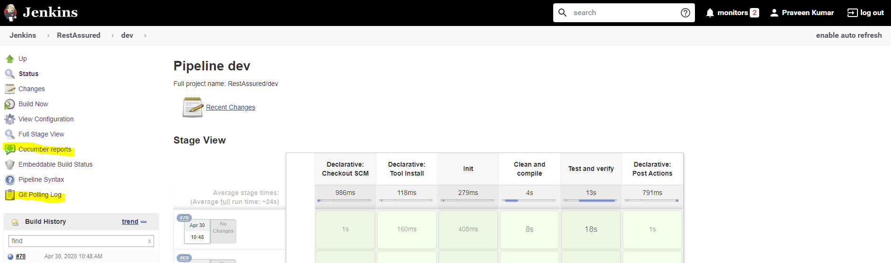
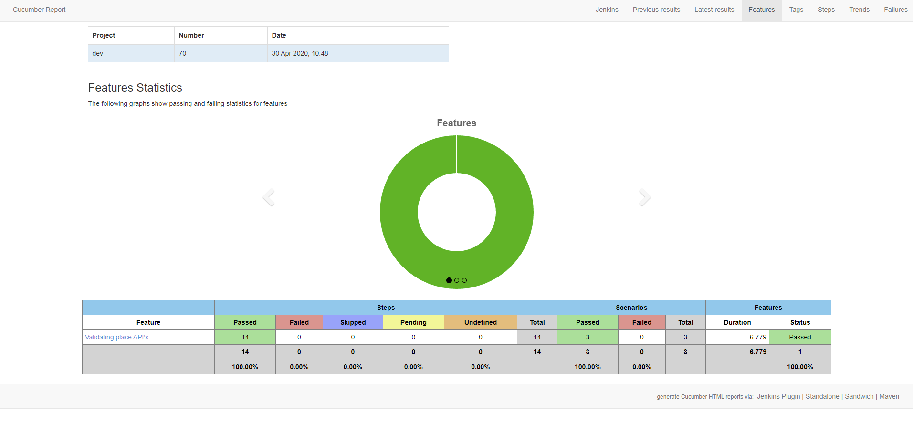

 RestAssured framework with cucumber:
  
   Jenkinsfile
   ```
   1. Tools: Name of the automatically installation of maven and jdk is given here.
   2. Trigger: It will trigger the build at provided intervals. pollSCM('') can be replaced with desired 
      build frequency example: pollSCM(* * * * *) 
   3. Environemnt: It will create environment variables. I am reading maven project attributes.
   4. Parameter: Never used in the project but can be created with the provided syntax.
   5. Stages: 
       1. Stage 1: Init: Print the project attributes.
       2. Stage 2: Clean and compile 
       3. Stage 3: Test and verify i .everify is used to generate cucumber report using plugin. 
               post call will always(Fail, pass unable state) feed report to jenkins plaugin.
   6. Post call: It will notify the git about the build status and put a red cross or green check 
      next to the commit according to build status in jenkins.
   ```

   pom.xml
   ```
   1. Profiling is used to feed default value to property attribute <jenkins.buildNumber>, otherwise while running any 
      maven command locally it will through NullPointerException.
   2. testResources block is used to filter the test resources and assign value to them at runtime. Here current 
      jenkins build number will be assigned to a variable in global.properties file in resources folder.
   ```
   
   POJO classes to serialise and deserialize the request and response respectively.
   ````
   AddPlace.java
   Location.java
   DeletePlace.java
   ````
   Helpers
   ````
   1. APIResources: Enum class to supply http method specific resource
   2. HelpersInitialization: Interface to initialize util and testdatabuild classes. Implement this interface wherever
      required in step definitions.  
   3. TestDataBuild: Build payload using POJO classes and consume data when called in definition.
   4. Utils: Utility for all the resuable methods like resquestSpec, responseSpec, getResource, readProperties, JSONPath
   5. global.properties: Contains project specific properties
   
   ````
   Step Definitions 
   ```
   TemporaryStore: 
   1. Applies singleton design pattern, so no other class can extend it and iniialze it.
   1. Stores requests and responses temporarily and can only be acessible using getters and setters.
   
   Hooks:
   1. Contains After, before and beforestep annotaions. 
   
   Givens, Whens, Thens:
   1. Classes contains step definitions as their name reflects.
   2. Create Baseclass object in it which gives access to APIResources, TestData, Utils.
   ```
   Reporting:
   ```
   1. Using Maven-cucumber-plugin to generate report
   2. logging.txt file will generate at run-time that will contain request payload and response along with hedears.
   ```

Images






